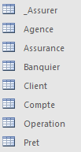
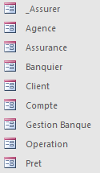

**13/01/2023** 

**Sae 1.04** 

**Banque**

**Douhab Illies & Soufflet Quentin   GROUPE : E **

**MCD (PowerAMC) : **

**Base De Données**  

**(Access) :** 

**Le projet était de concevoir la base de données d’une banque. Nous avons commencé par nous renseigner sur plusieurs banques. L’élément qui revenait le plus était :**  

- **L’Agence, qui sont les lieux qui possède est un lieux dans ce cas c’est une ville, qui possède deux propriétés, un code postal qui va nous servir de clef primaire pour cette entité, et le nom de la ville correspondant au code postal** 
- **Banquier, qui travaille dans une agence. Le banquier, qui est un humain avec un nom, prénom, numéro pour le contacter et comme clef primaire un ID qui sera dans ce cas-là Bno.**  
- **Client, il est assigné à un banquier. Le Client, qui est aussi un humain donc il va posséder des caractéristiques qui peuvent ressembler a celle du banquier comme un prénom, un nom, numéro de téléphone mais avec plus d’information comme l’adresse et l’email, là encore nous avons décider de définir un ID qui sera CCno** 

**Le Client peut faire plusieurs choses :** 

- **Le client peut posséder  un compte qui à plusieurs propriété tels que un numero de compte avec 16 chiffres qui va servir de clef primaire, un montant et un code** 
  - **Grace a ce compte on va pouvoir effectuer des opération qui ont un ID comme clef primaire pour pouvoir retracer des achat, un nom de Créditeur, la date de la transaction, un montant, et le Numéro de compte du Débiter**  
- **Le client peut un prêt pour lui, grâce à un ID de Prêt, un montant, la date de l’emprunt et son Numéro l’ID du client**  
- **Le peut aussi prendre une assurance qui à  comme clef primaire une ID, elle possède aussi un nom et un montant mensuel.** 

**Apres avoir réaliser toutes les tables nous avons finis pas faire les liaisons :**

****

- **Tables :** 

**Il y a 7 tables et 1 (\_Assurer) que nous avons ajouté par rapport à une association maillée.** 

- **Requêtes :**  

- **Formulaires :**  

- **Etats :**  

**Exemple de Formulaire :**  

- **La création des agences :**  

**Ce formulaire permet d’ajouter une agence avec un code postal et un nom de ville.** 

- **La création d’un banquier :** 

**La page ajout d’un banquier permet de rajouter un banquier dans la table Banquier, on commence par choisir une Agence dans la liste (prédéfinit dans la table agence) puis on ajoute ses informations tels que le Prénom, le Nom, le Numéro De Téléphone.** 

- **La création d’un client :** 

**Ce formulaire permet d’ajouter un nouveau Client dans la table correspondante, on peut choisir le banquier qui lui sera attitrer (qui sont prédéfinis dans la table Banquier). On peut ainsi entrer son Nom, Prénom, E-mail et l’Adresse personnel du client. L’ID (clef primaire) est déterminer automatiquement par la table Client.** 

- **La création d’un compte en banque :** 

**La création d’un compte s’effectue après la création d’un client (prédéfinit précédemment). On choisit donc le client en question, on lui assigne un numéro de compte, un montant, et un code. Un client peut alors avoir plusieurs comptes.** 

- **Opération :**  

**Ce formulaire permet d’ajouter une opération avec Le Débiteur (Le client), le montant, la date de la transaction, et le nom du créditeur.**  

- **Création d’une assurance :**  

**Permet de créer une assurance, avec le type et le prix associé à cette assurance.** 

- **S’assurer :**  

**Le formulaire permet de faire souscrire un client à une assurance.** 

- **Faire un Prêt :**  

- **Ce formulaire permet de faire un prêt avec le choix du demandeur de prêt, le montant et la date.** 

**Exemple Etats : **

- **Les banquiers et leurs agences** 

**Cet état permet de connaître la liste des banquiers ainsi que l’agence à laquelle ils sont associés sachant qu’un banquier ne peut être associer qu’à une seule Agence.** 

- **Les clients avec le banquier qui leur est attitré** 

**Cet état permet de connaître l’association entre le clients et le banquier, un client ne peut avoir qu’un banquier à la fois. Le banquier, peut lui avoir plusieurs clients à la fois.** 

- **Les clients et les assurances qu’ils ont choisis :**  

**Cet état montre les clients qui ont souscrit à une assurance, on peut ainsi connaître quel client a choisi quelle assurance et le montant mensuel de celle-ci.** 

- **Les clients :** 

**Affichage de la liste des clients.** 

- **Compte Des Clients :**  

**Affiche le nom, prénom, numéro de compte, et montant du compte du client.** 

- **Opération Client :**  

**Affiche le Réceptionnaire, la date de prélèvement, le numéro de compte Client, Prénom et Nom du titulaire du compte.** 

- **Prêt :** 

**Affiche les clients qui ont demandé un prêt avec le montant de celui-ci et la date ou le prêt a était demandé. **

**Bonus :** 

- **Création d’un formulaire de navigation qui permet d’avoir les formulaires réunis au même endroit**  

- **Requête pour savoir quel client est dans le négatif :**  

**SELECT Client.CCprenom, Client.CCnom, Client.CCnumero\_tel FROM Client INNER JOIN Compte ON Client.[CCno] = Compte.[CCno] WHERE (((Compte.Cmontant)<0));** 

- **Requête pour voir les informations concernant les clients se nommant** 

**« Nicolas » :**  

**SELECT Client.CCno, Client.CCprenom, Client.CCnom, Client.CCnumero\_tel, Client.Bno, Compte.Cno** 

**FROM Client INNER JOIN Compte ON Client.CCno = Compte.CCno WHERE (((Client.CCprenom)="Nicolas"));** 

- **Connaître les gens qui possède une Assurance Maladie ou Vieillesse :** 

**SELECT Assurance.AAno, Assurance.[AAnom/type], Assurance.AAmontant\_mensuel, [\_Assurer].AAAno, [\_Assurer].AAno, [\_Assurer].CCno, Client.CCno, Client.CCprenom, Client.CCnom, Client.CCnumero\_tel, Client.Bno** 

**FROM Client INNER JOIN (Assurance INNER JOIN \_Assurer ON Assurance.AAno = [\_Assurer].AAno) ON Client.CCno = [\_Assurer].CCno WHERE (((Assurance.[AAnom/type])="Maladie" Or (Assurance.[AAnom/type])="Vieillesse"));** 

**-Connaître les gens qui ont effectué un emprunt avant le 13/03/2022 et le montant :** 

**SELECT Pret.Pdate, Client.CCprenom, Client.CCnom, Pret.Pmontant FROM Client INNER JOIN Pret ON Client.[CCno] = Pret.[CCno] WHERE (((Pret.Pdate)<=#1/13/2022#));** 

